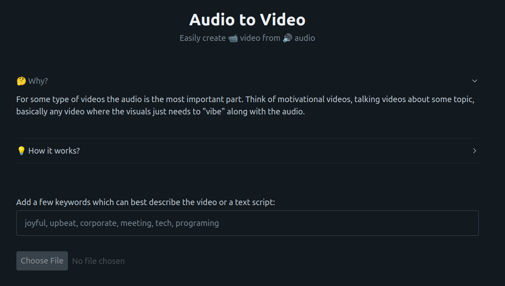

# Audio To Video

Easily create video from audio. This is useful when you need the video just to "vibe" with the audio (motivational videos, videos where what shows on the screen doesn't matter that much). I uses free videos from [pexels.com](https://www.pexels.com/) which are downloaded based on the related keywords provided. In the end it will create a .zip file with 2 videos one for mobile (TikTok etc) and one for desktop (Youtube, Vimeo etc). If you need full control of the videos that show up, you may want instead to just use [CapCut](https://www.capcut.com/) it's free they have a nice desktop app that works on windows, but also a web version (for linux users ;). This is app is for lazy folks who just want the video you add some text overlays and that's it.

## Installation

You need to have [`ffmpeg`](https://ffmpeg.org/download.html) installed. `ffmpeg` will be used to manipulate audio and video.

- Clone repo;
- Make virtualenv and install requirements;
- Create an account on pexels.com and get the apikey and paste it in `apikey.txt` file;
- Run `python main.py` and go in your browser to `localhost:3000` address;

## Usage

Once you are at `localhost:3000` in your browser you just need to provide some relavant keywords to your audio. The longer the audio the bigger the number of keywords you need to provide in order to show relavant videos (each keyword is a video).
If you provide the text script you used for the audio the app will download videos based on the most used words.

After you provide the keywords and upload the audio the app will do the folliwing:
- remove silence from audio provided;
- start downloading videos from pexels;
- ensure that there is enough video for audio provided;
- merging videos into one;
- adding audio to that video;
- making the mobile video format;
- making the zip;
